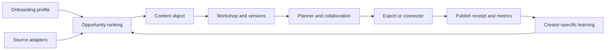

# Museboard Creator OS — Product and Experience Design

Date: July 13, 2026

Status: Approved direction; implementation planning pending

Working name: Museboard (not yet trademark-cleared)

## 1. Product thesis

Museboard is a creator operating system for broad, multi-niche creators. It helps a creator decide what to make, shape the idea in their own voice, turn it into a realistic production plan, collaborate with a small team, publish through a trustworthy native-finish workflow, and learn what to make next.

The product is not positioned as an AI content factory. Its core promise is:

> Plan content your audience wants, create it in your voice, and learn what to make next.

The first meaningful result appears within five minutes of onboarding: five relevant opportunities, three content pillars, one recommended angle, three hooks, and a feasible seven-day plan.

## 2. Decisions already made

- Audience: broad multi-niche creators with niche-personalized onboarding.
- Initial positioning: US-first and globally accessible, with USD anchor pricing.
- Product personality: an expert creative strategist that sharpens the creator's own thinking.
- Collaboration: team spaces for editors, managers, and collaborators are a paid expansion path.
- Activation: trend-backed ideas should become a personalized seven-day plan.
- Monetization: a genuinely useful free-forever product with monthly service limits; creators pay after experiencing the workflow.
- Publishing: export-first hybrid at launch; direct connectors arrive platform-by-platform after approval and compliance work.
- Visual direction: warm editorial atelier, based on the approved combined mock.
- Productivity model: the home screen must combine one recommended opportunity, an active production stage, a daily/weekly workload planner, collaborator state, and one audience learning.
- Themes: polished light and dark themes with an explicit toggle, system-default support, persistence, and no flash on load.
- 3D: subtle, optional, pausable, and non-essential to navigation or comprehension.

## 3. Approaches considered

### A. Scheduler-first dashboard

Lead with a calendar, publishing queue, and integrations. This is familiar and easier to explain, but it competes directly with Buffer, Later, and Metricool and does not solve the creator's hardest judgment problem.

### B. AI generation suite

Lead with captions, scripts, images, and video repurposing. This can create a fast demo, but the market is crowded, output quality is difficult to trust, and the product risks encouraging repetitive content.

### C. Creator operating system — selected

Own the full learning loop:

`opportunity → creator angle → hook → brief → plan → collaboration → native finish → result → learning`

This creates a reason to return weekly, supports both solo and team subscriptions, and differentiates through continuity and judgment instead of raw generation volume.

## 4. Research grounding

- Creator work is operationally heavy and often solo; Kolsquare's 2025 creator survey reported high stress and that most respondents managed their own workflows. [Kolsquare creator survey](https://7208750.fs1.hubspotusercontent-na1.net/hubfs/7208750/250701%20-%20Creators%20Survey%202025/250701-Voices-of-Creator-Economy-2025_Kolsquare_EN.pdf)
- Patreon research shows creators feel pressure to publish constantly and report burnout affecting motivation. [Patreon State of Create](https://stateofcreate.co/)
- Adobe/Harris research indicates strong interest in AI that learns a creator's style alongside material concerns about training consent and unreliable output. [Adobe Creators' Toolkit Report](https://news.adobe.com/news/2025/10/adobe-max-2025-creators-survey)
- Current tools fragment the loop across research, creation, planning, collaboration, and analytics: [Buffer](https://buffer.com/pricing), [Later](https://later.com/pricing/), [Metricool](https://metricool.com/pricing/), [vidIQ](https://vidiq.com/es/plans/), [OpusClip](https://www.opus.pro/pricing), and [Planable](https://planable.io/pricing/).
- Universal publishing cannot be presented honestly without platform approvals. Unaudited TikTok direct-post clients and unverified YouTube upload projects face visibility restrictions. [TikTok Content Posting API](https://developers.tiktok.com/doc/content-posting-api-get-started), [YouTube Videos API](https://developers.google.com/youtube/v3/docs/videos).

## 5. Primary users and jobs

### Solo creator

Needs to find relevant ideas, maintain a sustainable cadence, make content in their own voice, and understand what worked without becoming a full-time analyst.

### Creator with collaborators

Needs clear ownership, approvals, comments, due dates, and visibility across a small production pipeline without adopting enterprise project-management software.

### Editor or manager

Needs the source idea, angle, hook, brief, assets, platform version, deadline, and feedback in one object rather than scattered across chat, documents, and calendars.

### Core jobs to be done

1. Show timely opportunities for my niche and audience without making me chase trends all day.
2. Help me choose an original angle and hook before I invest in production.
3. Turn my thought into a script and shoot plan that still sounds like me.
4. Build a cadence around my available time and production complexity.
5. Adapt one story for each platform without blind duplication.
6. Keep collaborators aligned from brief through approval.
7. Export a complete, platform-ready package and record what was published.
8. Explain what worked, why it may have worked, and what to try next.

## 6. Release scope

### P0: complete sellable workflow

- Public marketing page with clear positioning, product proof, pricing, and call to action.
- Authentication and persistent creator accounts.
- Personalized onboarding for niche, audience, goals, voice, platforms, weekly capacity, and boundaries.
- Creator workspace with profile, content pillars, voice traits, and platform preferences.
- Evidence-backed opportunity feed with source, freshness, geography, audience fit, and expiry risk.
- Personalized Idea Board that clusters captured and recommended ideas by content pillar, format, readiness, and strategic goal.
- Vision Board for creator-uploaded references, links, images, notes, and inspiration, with rights/source metadata and clear separation from live trend evidence.
- Idea workshop: angle, hook, outline, script, shot list, assets, CTA, and platform variants.
- Contextual craft guidance inside the workshop for hooks, framing, lighting, audio, pacing, thumbnails, and platform-safe composition; guidance adapts to the current format instead of becoming a generic course library.
- Daily planner and seven-day workload-aware calendar.
- Pipeline states from idea through published.
- Team workspace with roles, assignment, comments, review, and approval.
- Export/native-finish package with captions, media checklist, platform variants, audio guidance, metadata, and publish checklist.
- Manual publish receipt: post URL, platform, timestamp, and status.
- Manual or CSV performance import with clear freshness and platform-native metric definitions.
- Learning feed that ties recommendations back to a creator's own content and shows sample size/confidence.
- Free and paid entitlements, Stripe Checkout, Stripe Customer Portal, webhook-driven subscription state, and a local demo billing mode when credentials are absent.
- Light, dark, and system themes.
- Responsive desktop and mobile experiences.

### P1: reviewed connectors

- Instagram Professional publishing and insights first.
- YouTube or TikTok next, based on demand and approval readiness.
- OAuth capability matrix so the UI only promises actions supported by the connected account and granted scopes.

### Explicitly not in P0

- Fake live trend feeds or scraped private endpoints.
- Universal one-click publishing.
- A universal trending-music API.
- Spotify audio synchronization or redistribution.
- Heavy server-side video rendering.
- Generic benchmark grades that pretend platform metrics are equivalent.
- Autonomous publishing without creator approval.

### Implementation slices and exit gates

P0 is delivered through five vertical slices. Each slice must pass its exit gate before the next one becomes the active implementation focus.

1. **Foundation and product shell**
   - Marketing, pricing, authentication, organization membership, theme system, responsive navigation, design tokens, error boundaries, audit primitives, and demo-mode labeling.
   - Exit: signup/login works locally, tenant isolation tests pass, the light and dark shells match the canonical visual source, and all routes have intentional empty/loading/error states.
2. **Solo creator loop**
   - Onboarding, opportunity corpus/ranking, Idea Board, Vision Board, workshop stages, planner, exports, publish receipts, metric import, and deterministic learnings.
   - Exit: each of the three launch-niche fixtures completes onboarding → opportunity → hook → plan → export → receipt → learning on desktop and mobile.
3. **Paid services**
   - Stripe Checkout/Portal, webhook projection, quotas, upgrade/downgrade behavior, and service metering.
   - Exit: entitlement contract tests pass; local demo billing works without secrets; configured Stripe test mode passes checkout, renewal, cancellation, and duplicate/out-of-order webhook tests.
4. **Collaboration**
   - Invites, roles, assignments, comments, approvals, notification inbox, and seat enforcement.
   - Exit: an owner can invite an editor, complete a version-bound review, invalidate approval with a later edit, and remove the member without orphaning activity history.
5. **Launch hardening**
   - Legal/support surfaces, data export/deletion, observability, backup/restore evidence, abuse/rate limits, performance/accessibility QA, production build, and browser verification.
   - Exit: the acceptance matrix in Section 22 is fully evidenced and no demo/curated state can be mistaken for live provider data.

The smallest sellable release is slices 1–3: a solo creator can habitually plan and pay for deeper strategist services. Slice 4 enables the Studio plan before it can be marketed. Direct social connectors remain P1.

## 7. Activation and onboarding

Onboarding is progressive and should take no more than five minutes before first value.

1. **Outcome:** grow an audience, publish consistently, launch something, promote work, establish expertise, or repurpose existing work.
2. **Identity:** broad niche, sub-niches, audience, location, language, creator stage, and admired references.
3. **Channels:** primary platforms, preferred formats, and current cadence.
4. **Capacity:** available weekly hours, production comfort, batch preferences, and recovery days.
5. **Voice:** pasted posts/transcripts or a short guided interview. Museboard extracts editable traits, vocabulary, pacing, opinions, humor, and phrases to avoid.
6. **Boundaries:** topics to avoid, claims requiring sources, rights/disclosure needs, and brand obligations.
7. **Starter workspace:** three pillars, five opportunity slots using valid sourced items plus clearly labeled evergreen fallbacks, one recommendation, three hooks, and a seven-day plan.
8. **Activation action:** the creator chooses and edits one hook. Account connections are offered only after the creator has seen value.

The starter five do not consume the Free weekly allowance. The normal Free allowance begins after the activation action.

P0 ships with three fully tested niche archetypes:

- **Music creator:** releases, live/performance footage, studio process, snippets, fan community, and audio-rights guidance.
- **Tech/education creator:** demonstrations, proof sources, claims, diagrams, prerequisites, and learning outcomes.
- **Lifestyle/business storyteller:** personal narrative, product obligations, locations, visual shot planning, expertise, and community prompts.

Creators can select multiple archetypes and rank a primary one. Shared pillars are merged; conflicting format or tone advice is shown separately instead of silently averaged. Every other niche uses an explicit "General creator" fallback with the same workflow and neutral vocabulary. P0 is US English; language selection is captured for future localization but unsupported languages are not presented as generated-output options.

## 8. Information architecture

### Public routes

- `/` — landing page and product story
- `/pricing` — plans, limits, FAQ, and upgrade path
- `/login` and `/signup`
- `/privacy`, `/terms`, and `/data-policy`

### Product routes

- `/onboarding`
- `/app/today`
- `/app/opportunities`
- `/app/opportunities/ideas`
- `/app/opportunities/vision`
- `/app/create/[contentId]`
- `/app/plan`
- `/app/learn`
- `/app/team`
- `/app/settings/profile`
- `/app/settings/connections`
- `/app/settings/billing`

### Navigation

Desktop uses a concise left rail: Today, Opportunities, Create, Plan, Learn, Team. Mobile uses a bottom navigation for Today, Opportunities, Create, and Plan, with Learn, Team, and Settings under a More sheet.

- Header capture accepts plain text, a URL, or a file and creates a draft Idea Board item after confirmation. Search covers the current workspace's content titles, idea/vision items, people, and comments; it never searches across organizations.
- Opening Create without a `contentId` shows recent drafts plus New from opportunity, New from idea, and Blank content. It does not create an empty record until the user chooses.
- Notifications open a workspace-scoped inbox for assignments, mentions, review requests, approval changes, export completion, billing status, and failed jobs. Each notification has an exact destination and intentional empty/error state.
- Quick capture is locally buffered when offline and clearly marked pending until server sync succeeds. Conflicts preserve both drafts.

Opportunities is a compact three-view workspace:

- **For You:** sourced, freshness-labeled opportunities ranked for the creator.
- **Idea Board:** captured and generated ideas grouped by pillar, format, readiness, and goal.
- **Vision Board:** creator-curated visual and textual references with source and rights notes. Vision references can inspire an angle but are never presented as evidence that a topic is trending.

The Create workshop exposes contextual craft help beside the active step. Hook guidance appears while choosing a hook; framing, lighting, audio, and safe-zone guidance appears while planning the shoot. This keeps help actionable and avoids a separate, overwhelming tips dashboard.

## 9. Home experience

The home screen answers only:

1. What should I make today?
2. What is moving toward publication this week?
3. What did my audience teach me?

### Desktop hierarchy

- Header: current workspace, date, search/capture, notifications, and theme toggle.
- Primary opportunity: title, source, freshness, audience fit, why-now explanation, selected angle, and one next action.
- Production spine: Signal → Angle → Hook → Outline → Script → Shoot → Review → Ready.
- Daily planner: effort-aware tasks for the current week, breathing room, drag-to-reschedule, and workload guidance.
- Collaborator context: assignee, reviewer, due date, and the most relevant unresolved comment.
- Learning strip: one creator-specific observation with sample size, metric definition, and confidence.

### Mobile hierarchy

- Today action and selected opportunity first.
- Active stage as a vertical checklist.
- Swipeable seven-day planner with touch-sized controls.
- Quick capture, script review, shot checklist, approvals, rescheduling, export status, and publish recovery.
- No hover-only interactions or 3D-dependent controls.

### Planner contract

- Capacity is stored as minutes per week plus one or more preferred production windows and optional recovery days.
- Tasks use 15-minute increments, an IANA timezone, a due date, stage, dependency list, and one of `planned`, `in_progress`, `done`, `missed`, or `cancelled`.
- Museboard schedules no more than 80% of declared weekly capacity by default, leaving buffer for capture and recovery. The creator can override with an explicit overload confirmation.
- Dependencies prevent a downstream task from being recommended as today's action, but never prevent the creator from manually moving it.
- "Breathing room" is real unused capacity, not a task. A recovery day remains clear unless the creator explicitly schedules into it.
- An overdue task stays visible with Move, Mark done, Skip, and Re-plan actions; it is never silently rolled forward.
- Desktop drag-and-drop always has a keyboard-accessible Move action. Mobile uses a date/time picker and day-suggestion sheet rather than drag-only behavior.
- Timestamps are stored in UTC and displayed in the workspace timezone. DST changes retain the intended local wall-clock time and show a conflict message if the local time does not exist.
- Workload guidance is deterministic: under 60% capacity is comfortable, 60–80% is focused, 80–100% is heavy, and over 100% is overloaded. It does not make health claims.

Acceptance fixtures cover an empty week, an overloaded week, a missed recording task with downstream dependencies, a recovery day, a timezone change, DST transition, and the same reschedule on desktop keyboard and mobile touch.

## 10. Content object and state model

The primary object is a continuous content record:

`idea → evidence → angle → hooks → outline → script → shot plan → assets → variants → schedule → approvals → export → publish receipt → performance → learning`

One `workflow_stage` is the single editorial source of truth:

`signal → angle → hook → outline → script → shoot → review → ready → published → measured → archived`

- Idea Board items are not content records until promoted; they use only `captured`, `saved`, `promoted`, or `archived`.
- Advancing from `angle` onward creates an immutable `content_version` snapshot. Editing a stage creates a new current version; history remains readable.
- Each stage has one optional assignee, due date, task estimate, and stage-specific completion data in `stage_instances`.
- Entering `review` freezes the submitted version for reviewers. Approval records the exact `content_version_id`.
- Editing any approved field creates a new version and changes the approval to `stale`; the old approval remains in history.
- `ready` requires a current approval when the workspace has approval enabled, resolved blocking validations, and at least one exportable platform variant.
- An export records the exact content and variant versions. Later edits do not mutate the ZIP; they mark it `outdated` and offer a new export.
- A publish receipt belongs to one platform variant and one export/content version. The same external post URL cannot be attached twice within an organization.
- `published` means at least one valid receipt exists. `measured` means at least one validated metric snapshot exists. A receipt can be corrected with an audit event but not silently replaced.
- Every transition records actor, timestamp, previous stage, next stage, version, and optional note.

Future connectors use a separate delivery state machine—`draft → approved → scheduled → dispatching → platform_processing → published | failed_retryable | failed_final | cancelled`—so delivery failure cannot corrupt editorial state.

## 11. Collaboration model

### Roles

- Owner: billing, workspace settings, membership, all content actions.
- Editor: create/edit content, upload assets, assign work, comment, submit for review.
- Viewer: view and comment; cannot change strategy or publish state.

### Interaction rules

- One current assignee and optional reviewer per stage instance.
- Inline comments attach to the content object or a specific stage.
- Comments support resolve/reopen and mention notifications.
- Approval is explicit and version-bound; edits after approval mark the approval stale.
- The activity log exposes important changes without becoming a noisy feed.
- Owners invite by email into a specific workspace and role. Invites expire after seven days and support resend, revoke, accept, and decline.
- A pending invite reserves a seat. When the plan has no seat available, the invite is blocked before email is sent and the exact plan limit is shown.
- Removing a member revokes future access while preserving authored comments and audit events. Ownership must be transferred before the only owner can leave.
- Mentions create an in-app notification. Transactional email is opt-in per notification type; delivery failure never hides the in-app item.
- The notification inbox supports unread/read, mark all read, workspace filtering, and links to the exact version/stage/comment.
- Cross-workspace access is membership-based; switching workspaces clears cached tenant data before the next workspace renders.

## 12. Trend, opportunity, and music integrity

### P0 source strategy

P0 uses an operator-curated US-English opportunity corpus for Instagram, TikTok, and YouTube rather than undocumented scraping or a fake live feed.

- An internal ingestion form accepts a public source URL, source title, publisher/platform, observed time, geography, niche tags, format tags, evidence excerpt written by the operator, expiry time, and rights/usage note.
- Allowed source classes are official platform trend/search surfaces, official platform reports, public first-party creator/channel pages supplied by the user, and editorial/public datasets whose terms permit linking and summarization. The corpus stores links and short operator summaries, not copied articles or media.
- P0 does not scrape authenticated creator insights. A creator may paste a URL or add a manual observation; user-provided evidence is labeled `Added by you`.
- The operator reviews launch archetypes at least twice per week. Time-sensitive opportunities expire after 72 hours unless explicitly renewed from fresh evidence; broader cultural signals expire after seven days; evergreen prompts expire after 30 days.
- Onboarding receives candidates no older than seven days plus evergreen fallbacks. If fewer than five valid candidates match, Museboard shows the available sourced items and fills the remainder with clearly labeled `Evergreen prompt`, never a fabricated trend.
- Demo mode uses a frozen corpus labeled `Sample workspace · not live`, with a visible fixture date. Production never silently falls back to demo rows.

### Deterministic ranking

`audience_fit = pillar_match 30% + platform_format_match 20% + stated_goal_match 20% + niche_archetype_match 15% + freshness 10% + prior_learning_adjustment 5%`

Each factor is shown in a "Why this" disclosure. Missing factors contribute zero rather than guessed values. Creator-specific learnings may change the score by no more than five points in P0. The score is never labeled a probability of virality.

### Opportunity and music display

- Each opportunity shows source, observed/fetched time, expiry, geography when relevant, platform, and why it matches the creator.
- Stale or unavailable data is labeled clearly and removed from recommended slots after expiry.
- Music guidance supports TikTok, Instagram Reels, and YouTube Shorts through platform-native discovery links plus operator/user notes. Rights vocabulary is `platform-native only`, `user-owned`, `licensed by user`, `royalty-cleared proof attached`, or `rights unknown`.
- `rights unknown` blocks inclusion of the audio file in an export but does not block a note reminding the creator to finish natively.
- A saved-audio item stores the platform URL, title/description, geography, observed time, rights status, and user attestation. Museboard never downloads or redistributes platform audio in P0.
- When no music source is available, the product offers mood, pacing, and sound-design guidance without naming a "trending" track.

### Craft guidance

P0 ships with 24 reviewed micro-guides: eight each for short video, long video, and static/text formats, covering hooks, framing, lighting, audio, pacing, thumbnails, safe zones, and disclosure. Every guide records author/source, last-reviewed date, supported formats/platforms, and creator-stage tags. The workshop shows at most one primary and one optional tip for the active stage; if no trustworthy guide matches, it shows none.

The system avoids mass-produced, repetitive output and asks the creator to add an original perspective before creating variants.

## 13. Voice and AI behavior

### Voice contract

- A `voice_profile` is an explicit, workspace-owned set of editable traits: tone, pacing, sentence shape, vocabulary to prefer, phrases to avoid, humor, point of view, and example excerpts.
- Performance learnings are stored separately and never silently rewrite voice traits.
- Voice extraction is opt-in. The creator previews and confirms traits before they influence generation.
- The creator can disable, edit, reset, export, or delete the profile. Deletion removes source excerpts and derived traits while preserving unrelated content versions.
- Connected or uploaded content is not represented as provider training material. Production provider terms, retention, and subprocessors are disclosed; a provider is launch-eligible only if customer API data is excluded from model training by default and its retention posture is documented.

### Strategist service contract

The `StrategistProvider` interface accepts a versioned JSON request containing creator goal, niche archetypes, audience, selected pillar, opportunity/evidence IDs, selected voice traits, boundaries, target platform/format, current stage, and previous creator edits. It returns schema-validated JSON containing distinct angles, three hook strategies, promise labels, outline beats, source references, and safety/rights flags.

Every valid result stores provider, model identifier, prompt version, input hash, voice-profile version, opportunity/source IDs, generation time, latency, and output schema version. This provenance is visible in a compact "How this was made" view.

- A complete strategist content pack is metered only after the server receives a schema-valid result and creates a content version.
- Validation failures, provider timeouts, safety refusals, and automatic retries do not consume allowance.
- One user-requested regeneration consumes one pack only after it succeeds; manual edits are unlimited.
- Target p95 generation latency is 15 seconds with a 25-second hard timeout. The interface streams or explains progress, preserves all user input, and allows cancellation.
- The production cost guardrail is $0.25 maximum provider cost per successful Creator/Pro pack and $0.40 for Studio. Requests that would exceed the configured cap require a cheaper strategy or a clear unavailable state; no hidden overage is charged.
- One primary provider and one schema-compatible fallback may be configured. Demo/local mode uses deterministic fixtures and is always labeled sample output.
- Generated content is always an editable draft. High-stakes claims can be marked `source_required` and block `ready` until evidence is attached.
- Moderation occurs before storage and before provider calls where appropriate. Disallowed requests return a plain-language boundary and do not consume allowance.
- Provider errors offer retry, simplify, or continue manually. Usage and paid-service limits are visible before an action begins.

## 14. Monetization

The basic planning habit remains usable without a card.

### Free — $0

- One creator workspace.
- Unlimited idea capture, manual planning, and calendar use.
- Five sourced opportunities per week.
- Two complete strategist content packs per month.
- Basic exports and manual publish receipts.
- Manual metrics for up to ten published posts.

### Creator — $19/month

- Thirty strategist content packs per month.
- Full voice profile and source-aware drafting.
- Full platform-ready exports.
- Ongoing performance learning.
- Expanded opportunity feed.

### Pro — $39/month

- One hundred strategist content packs per month.
- Repurposing and native platform variants.
- Advanced analytics imports and deeper learnings.
- One collaborator.
- Priority generation queue when applicable.

### Studio — $79/month

- Three creator workspaces.
- Five collaborators.
- Two hundred fifty strategist content packs per month.
- Assignments, approvals, shared calendars, and workspace reporting.

Annual pricing can be introduced after usage data validates monthly limits. Entitlements live in application data and are projected from Stripe events; the success redirect never grants access by itself.

### Action-level entitlement contract

| Capability | Free | Creator | Pro | Studio |
|---|---:|---:|---:|---:|
| Creator workspaces | 1 | 1 | 1 | 3 |
| Members including owner | 1 | 1 | 2 | 6 |
| Sourced opportunities | 5/week | 30/month | 100/month | 250/month |
| Successful strategist packs | 2/month | 30/month | 100/month | 250/month |
| Manual ideas, planner tasks, edits | Unlimited | Unlimited | Unlimited | Unlimited |
| Export history | 30 days | 12 months | 24 months | 24 months |
| Metric history | 10 posts | 12 months | 24 months | 24 months |
| Comments and approvals | No | No | 1 collaborator | 5 collaborators |
| Platform variants per content item | 1 | 3 | 5 | 5 |

- Free opportunity allowance resets Monday at 00:00 in the workspace timezone. Paid monthly allowances reset on the Stripe billing-period boundary.
- Onboarding's starter opportunities and first successful starter pack do not consume allowance.
- A "pack" is the successful schema-valid creation of angles, three hooks, and an outline for one content version. Failed/cancelled attempts do not count.
- Upgrade entitlements become active only after the verified Stripe event and current subscription fetch. Downgrades and cancellations take effect at period end; users retain read/export access to existing data.
- Failed renewal enters a seven-day grace period with clear billing status. Paid generation is paused after grace, while manual planning and data export remain available.
- Limits are checked in both UI and server transaction. Concurrent requests reserve allowance transactionally and release it on failure.

### Habit loop

- Monday: refresh five Free opportunities and invite the creator to shape one weekly focus.
- Daily: Today shows one effort-sized next action, not a streak penalty.
- After publish: request a receipt and schedule a results check at a platform-appropriate interval.
- Weekly review: summarize completed work, one learning, and one next experiment.
- Email/in-app reminders are opt-in, frequency-controlled, and stop after inactivity rather than escalating pressure.

Activation metrics are onboarding completion, first hook chosen, and first planner task scheduled. Retention metrics are week-two return, weekly-plan completion, first export, first publish receipt, and first inspected learning. Upgrade events are a successful pack limit, need for longer analytics history, second member invite, or second workspace—not artificial feature interruption.

## 15. Visual system

### Canonical visual source

The implementation sources of truth are [`docs/design/museboard-approved-today-light.png`](../../design/museboard-approved-today-light.png) and [`docs/design/museboard-approved-today-dark.png`](../../design/museboard-approved-today-dark.png), generated at 1487×1058 and reviewed as the 1440×1024 desktop directions.

- **Mandatory:** warm editorial hierarchy, ivory/ink/coral/cobalt palette, left navigation, one dominant opportunity, horizontal production spine, useful right-side week planner, inline collaboration, audience-learning strip, generous spacing, and restrained borders/shadows.
- **Adaptive:** exact line wraps, sculpture crop, planner width, collaborator placement, and typography scale may change to preserve readability across viewports.
- **Decorative:** paper texture, paint marks, and woven 3D sculpture may simplify or disappear for dark mode, reduced motion, constrained memory, or WebGL failure.
- **Intentional change:** the implementation adds a visible light/dark toggle, robust focus/hover/pressed/error states, real scroll behavior, and responsive mobile composition that the static source does not depict.

Component/state inventory for visual QA: navigation default/active/collapsed; opportunity default/saved/expired/loading/error; stage default/complete/active/blocked; hook default/selected/editing/error; planner comfortable/heavy/overloaded/overdue; collaborator pending/active/removed; comment unresolved/resolved; theme light/dark/system; sculpture running/paused/fallback.

### Light theme

- Sun-washed ivory background.
- Deep ink primary text.
- Vermilion/coral primary actions.
- Cobalt information accents.
- Pale butter and restrained sage for supportive states.
- Tactile paper/photo texture only where it strengthens the editorial mood.

### Dark theme

- Warm near-black, not pure black.
- Soft parchment text instead of stark white.
- Coral remains the primary action but is tuned for dark-surface contrast.
- Cobalt becomes brighter and less saturated.
- Decorative textures and 3D highlights are reduced to prevent glow fatigue.

### Theme behavior

- Options: Light, Dark, System.
- The explicit header toggle switches light/dark immediately; a settings control selects System.
- Preference persists per user and is also cached locally to avoid a flash before authentication data loads.
- Semantic color tokens drive both themes. No component owns raw theme colors.
- Every state passes WCAG 2.2 AA contrast targets, including focus, disabled, selected, error, and chart states.

### Typography and spacing

- One editorial display serif plus one neutral product sans.
- Product body text: 14–16px; no essential text smaller than 12px.
- A consistent 4px spacing base with an 8/12/16/24/32/48/64 scale.
- Page gutters: 64px desktop, 32px tablet, 16–20px mobile.
- Minimum interactive target: 44×44px.
- Long text stays near 65 characters per line.
- Sections separate through spacing, alignment, and hairlines before backgrounds, borders, or shadows.

### 3D behavior

- The woven idea sculpture is decorative/contextual and loaded as a client-only enhancement.
- Static image fallback for reduced motion, failed WebGL, server render, `navigator.connection.saveData`, or measured device-memory/hardware-concurrency thresholds where supported. "Low-power mode" is never claimed as directly detectable.
- Pause control is visible; animation pauses offscreen and when the tab is hidden.
- Canvas is `aria-hidden`; equivalent context labels remain in semantic DOM.
- Initial 3D JavaScript budget is 180KB gzip after lazy-load; texture payload is 350KB maximum; active GPU target is under 32MB; device pixel ratio is capped at 1.5.
- The sculpture renders on demand when idle, targets 30fps during interaction, pauses when hidden, and disposes geometries, materials, textures, controls, and the renderer on unmount.
- Navigation, selection, data, and actions remain complete without the canvas.

## 16. Interaction and state quality

- Autosave creator work with visible saved/saving/error states.
- Empty states use onboarding context to provide one meaningful next action.
- Loading states explain what is being researched or generated and allow cancellation when feasible.
- Errors identify the failed system, whether data was saved or published, and the safest recovery.
- Undo is available for reversible planner and content-state actions.
- Version history protects scripts, hooks, and approvals.
- "Scheduled", "ready for native finish", and "published" are never visually ambiguous.
- Desktop supports keyboard navigation and visible focus order.
- Mobile supports touch-first capture, review, rescheduling, and recovery.

## 17. Export-first publishing

An export is a complete handoff, not a text download.

P0 supports Instagram Reels, TikTok video, and YouTube Shorts. Export validation uses versioned platform fixtures for these three targets; other platforms can use a clearly labeled generic package.

Each package contains:

- Platform-specific caption and metadata.
- Final script and hook.
- Asset checklist and available media files.
- Aspect-ratio and safe-zone guidance.
- Thumbnail/title options where relevant.
- Audio guidance and rights status.
- Disclosure/AI-label reminders.
- CTA and link notes.
- A publish checklist.
- A manifest tying the export to content version and approval.

### ZIP contract

Filename: `museboard-{project-slug}-{platform}-{yyyy-mm-dd}-v{version}.zip`

```text
manifest.json
README.md
caption.txt
script.md
shot-list.csv
publish-checklist.md
metadata/{platform}.json
assets/{original-file-name}
```

`manifest.json` contains schema version, organization/content/version/variant IDs, platform, generated time, approval ID/status, file names with SHA-256 hashes, rights status, disclosures, and validation results. The server streams the ZIP without storing a second public copy; an export record stores the manifest and private object reference when retention is enabled.

- Maximum ZIP size: 500MB. Maximum individual asset: 250MB. The UI shows projected size before export.
- Asset inclusion requires an organization-owned/private upload plus rights status. Links and unknown-rights audio appear as references in `README.md`, never as downloaded files.
- Exported files are immutable. New content versions create new export versions and mark older exports outdated without deleting them.
- Validation failure names the exact field/asset and prevents a `complete` export status. No partial ZIP is presented as complete.
- Desktop provides Download ZIP and field-level Copy actions. Mobile uses the Web Share API for supported files and falls back to a normal download with clear save/open guidance.
- P0 does not depend on fragile compose deep links. "Open Instagram/TikTok/YouTube" opens the official app/site landing surface after the package is ready and explains what still needs native finishing.

Platform fixtures verify caption/metadata fields, allowed aspect-ratio guidance, disclosure reminders, title/thumbnail presence where relevant, and platform-specific README instructions. A downloadable reference package for each P0 platform is checked into test fixtures and inspected during release QA.

The user can then record a post URL and publication time. Export status is recorded independently for each platform variant.

### Publish receipt, metric import, and learning contract

P0 accepts manual entry and versioned CSV templates for Instagram Reels, TikTok video, and YouTube Shorts. Each metric fact stores platform, external post URL/ID, published time, fetched/imported time, reporting window, raw platform metric name, normalized semantic category, value, unit, and source file/row. Views, plays, reach, and impressions remain distinct raw metrics; the UI never presents them as the same measure.

- Imports use the workspace timezone for naive timestamps and require confirmation before save.
- The preview maps columns, shows definitions, flags unknown fields, and reports row-level errors without discarding valid rows.
- Duplicate identity is `(organization, platform, external_post_id_or_url, metric_name, reporting_window)`. Reimport offers Skip, Replace corrected values, or Cancel.
- Deleting an import removes its facts and recomputes affected learnings. The audit record keeps metadata, not deleted metric values.
- Supported v1 comparison dimensions are hook strategy, content pillar, format, opening style, CTA style, and posting-time bucket, within the same platform and format only.
- A learning requires at least five total posts and at least three posts in each compared group. Creator baseline is the median of the prior 5–20 comparable posts.
- Effect is reported as a directional association, never causation. Low confidence: minimum threshold only or effect under 10%. Medium: at least five per group and effect ≥10%. High: at least ten per group, effect ≥15%, and the direction is stable in two non-overlapping time windows.
- A learning displays included posts, excluded posts, exact metric definition, sample size, effect, confidence rule, and last recomputed time.
- Creators can inspect, dismiss, restore, correct underlying tags, or delete the learning. Dismissed learnings stop influencing ranking.
- Active learnings can adjust opportunity ranking by no more than the five-point prior-learning factor. Voice traits remain unaffected.

Deterministic fixtures cover sparse data with no learning, a medium-confidence hook association, a high-confidence stable format association, incompatible cross-platform metrics, duplicates, correction/reimport, and deletion/recomputation.

## 18. Architecture

### Application

- Next.js App Router with TypeScript.
- Server Components by default; client components only for interaction-heavy islands.
- Server-only data-access layer; route handlers for OAuth callbacks, Stripe webhooks, exports, and future connector APIs.
- Supabase Postgres, Auth, private Storage, migrations, and Row-Level Security.
- Stripe-hosted Checkout and Customer Portal.
- Three.js/React Three Fiber for the optional idea sculpture.
- Provider adapters for opportunities, AI strategy, publishing, and analytics.
- A local demo adapter supplies clearly labeled sample data when external credentials are absent.

### Core data boundaries

- `organizations`, `memberships`, `creator_profiles`, `voice_profiles`
- `content_pillars`, `opportunities`, `opportunity_sources`
- `idea_board_items`, `vision_boards`, `vision_board_items`, `craft_guides`
- `content_items`, `content_versions`, `stage_instances`, `hooks`, `content_variants`
- `planner_entries`, `stage_assignments`, `comments`, `approvals`, `notifications`
- `assets`, `exports`, `export_files`, `publish_receipts`
- `social_connections`, `publish_attempts`, `metric_facts`
- `metric_imports`, `learnings`, `learning_samples`, `subscriptions`, `entitlements`, `usage_events`, `audit_events`

Every tenant-owned record includes `organization_id`. RLS and the server data layer both enforce membership.

### Data flow



### Jobs and idempotency

- Scheduled jobs and webhooks write to durable tables.
- Handlers store external event IDs and reject duplicates.
- Publishing attempts use idempotency keys and explicit retry/final states.
- External callbacks are treated as unordered and at-least-once.

### Operational contract

- Structured logs include request/job ID, organization ID hash, actor ID hash, route/job name, result, duration, and error class; content, tokens, and secrets are redacted.
- Error monitoring covers browser, server, jobs, webhooks, export assembly, and deletion jobs with release tags and alert ownership.
- A private support/admin surface can find an organization by verified identifier, inspect non-content audit/job state, replay safe failed webhooks/jobs, and initiate account export/deletion. Support impersonation is not in P0.
- Failed jobs retain retry count, next attempt, last safe error, and dead-letter status. Replay is idempotent and audited.
- Rate limits apply by IP before auth and by organization/user after auth. Generation, invites, uploads, exports, and imports have distinct limits.
- Feature flags gate AI providers, billing, collaboration, analytics import, and 3D independently, with safe off states.
- Daily database backups and private-storage versioning are required in production. Launch hardening includes one documented restore drill to a separate environment.
- Data-export and deletion jobs show user-visible status and alert operators if they exceed the published SLA.

## 19. Security, privacy, and compliance

- RLS on every exposed tenant table; authorization also checked near the data source.
- `service_role` and provider secrets never reach the browser.
- Social tokens encrypted at rest with a rotatable key before production connectors launch.
- OAuth uses state, PKCE where supported, exact redirect allowlists, minimum scopes, reconnect, and revoke flows.
- Private storage, short-lived signed URLs, file type/size/dimension validation, EXIF stripping, and malware scanning for risky uploads.
- Stripe webhook signature verification, duplicate protection, and out-of-order reconciliation.
- Data export, account deletion, social disconnect, and token revocation workflows.
- Privacy policy explains AI usage, subprocessors, retention, deletion, and user controls.
- Audit events cover membership, billing, approvals, exports, publishing, and deletion.
- Vision Board accepts HTTPS links and JPG, PNG, WebP, PDF, MP4, and MOV uploads only. P0 limits each workspace to 2GB, each image/PDF to 25MB, and each video to 250MB. Duplicate hashes offer reuse rather than another upload.
- Link previews store title, hostname, user note, and permitted preview metadata. References are private to the workspace, removable, and never treated as opportunity evidence without a separate operator/user source record.
- Generation receives only references the creator explicitly selects for that request. Rights status and provenance remain attached; removal prevents future use.
- US launch defaults to USD, en-US dates/copy, a 13+ minimum age with account attestation, clear cancellation timing, receipts, refund/support contact, FTC sponsorship/disclosure reminders, Terms, Privacy, Data/AI policy, and a legal-review checklist before production billing is enabled.
- Stripe Tax is not enabled until registrations and product tax codes are reviewed. The product states taxes, trial/renewal terms, and cancellation effect before Checkout.

## 20. Failure and recovery design

- **Opportunity source unavailable:** show the last successful fetch time and offer evergreen ideas; never imply freshness.
- **AI strategy failure:** retain input, show no usage charge where applicable, retry or continue manually.
- **Autosave conflict:** preserve both versions, explain the conflict, and provide a readable merge choice.
- **Asset upload failure:** retain draft metadata, show progress/retry, and never lose other form data.
- **Export failure:** identify the failed asset or validation rule; partial packages are not marked complete.
- **OAuth failure:** show provider-specific cause and retain current content state.
- **Publishing uncertainty:** use "checking status" until reconciled; never guess published/failed.
- **Billing webhook delay:** show pending state; do not grant access from redirect parameters.
- **Entitlement limit:** explain the exact limit before generation and offer upgrade or manual continuation.

## 21. Testing and verification

### Automated

- Unit tests for ranking explanations, content-state transitions, entitlements, theme preference, export manifests, and metric definitions.
- Integration tests for onboarding persistence, tenant isolation, comments/approval invalidation, Stripe webhook idempotency, and export assembly.
- Contract tests for provider adapters using recorded fixtures.
- End-to-end tests for signup → onboarding → opportunity → hook → plan → collaboration → export → publish receipt → learning.
- Accessibility checks with automated scanning plus keyboard/manual review.

### Visual and browser QA

- Desktop at 1440×1024 and common laptop widths.
- Mobile at 390×844 and narrow 320px stress case.
- Light, dark, and system themes.
- Reduced motion, WebGL unavailable, slow network, empty data, loading, failure, and long-content states.
- Full-page screenshots compared against the approved combined mock for hierarchy, spacing, typography, padding, border radius, and theme fidelity.
- Real exported ZIP/package inspected directly.
- Supported production matrix: current and previous major desktop Chrome, Safari, and Firefox; current and previous major iOS Safari and Chrome Android.
- Manual accessibility matrix: keyboard-only desktop, VoiceOver on Safari/iOS, and one Android screen-reader smoke pass.
- Constrained runs: `saveData`/slow 4G emulation, JavaScript delayed, WebGL unavailable, 4GB-class device emulation, offline quick capture, and mid-request network loss.

### Performance targets

- LCP ≤ 2.5s, INP ≤ 200ms, CLS ≤ 0.1 on representative production pages.
- 3D is lazy-loaded, paused when hidden, and excluded from the critical rendering path.
- No route requires 3D or a large media asset to become interactive.

## 22. Acceptance checklist

The first release is acceptable when:

1. A new user can understand the product and start free without a card.
2. Onboarding produces a personalized starter workspace within five minutes.
3. The user can select a sourced opportunity and understand why it is recommended.
4. The user can edit an angle, compare hooks, and continue manually if generation is unavailable.
5. The active content record persists across the complete production spine.
6. The daily planner shows effort, breathing room, and workload guidance.
7. A collaborator can comment, receive an assignment, and approve a version.
8. A later edit correctly marks the old approval stale.
9. The user can create and inspect a platform-ready export package.
10. The user can record a published URL and import or enter performance data.
11. A learning references the creator's own sample size and confidence.
12. Free and paid entitlements behave consistently in UI and server checks.
13. Stripe events are verified and idempotent when Stripe credentials are configured.
14. Light/dark/system themes persist without a flash and remain accessible.
15. Desktop and mobile primary workflows are fully usable.
16. Reduced-motion and WebGL-fallback experiences retain all functionality.
17. Empty, loading, error, retry, and recovery states are understandable.
18. Tests, lint, typecheck, and production build pass.
19. Browser QA passes in both themes at desktop and mobile sizes.
20. No unrelated or hidden demo state is presented as live production data.

### Concrete release fixtures and evidence

The release evidence folder must contain automated results, screenshots, and inspected artifacts for:

1. **Music creator:** US indie musician, TikTok + Instagram Reels, six weekly hours, recovery Thursday. Receives at least three music-relevant sourced/curated opportunities plus explicit evergreen fallbacks, chooses a hook, schedules within 80% capacity, and exports a TikTok package without redistributing audio.
2. **Tech educator:** US software educator, YouTube Shorts + long video, four weekly hours, claims marked source-required. Cannot enter `ready` until evidence is attached; exports valid Shorts metadata.
3. **Lifestyle/business storyteller:** multi-niche creator with sponsored-content boundary and one collaborator. Completes version-bound comment/approval, then edits and observes stale approval.
4. **Sparse account:** no historical posts. Sees no fabricated performance learning and can complete the manual workflow.
5. **Quota exhaustion:** Free creator uses two successful packs, sees the exact reset/upgrade choice before a third, and continues manual editing without data loss.
6. **Provider failure:** timeout preserves input, consumes no quota, and allows deterministic/manual continuation.
7. **Analytics import:** duplicate and corrected rows preview correctly; incompatible platform metrics remain separate; deletion recomputes learnings.
8. **Mobile export:** a 390×844 device completes hook selection, move-task action, package generation, Share/download fallback, and publish receipt.
9. **Offline capture:** a captured idea survives reload, syncs when online, and preserves both versions on conflict.
10. **Theme/accessibility:** light/dark/system load without flash; keyboard and screen-reader paths reach every primary action; reduced-motion/WebGL-fallback behavior remains complete.

Pass/fail thresholds: onboarding starter result under 30 seconds in deterministic mode and under 60 seconds with configured AI; non-AI route response p95 under 800ms in staging; export generation under 15 seconds for a 100MB fixture; no axe serious/critical violations; zero cross-tenant access in RLS/integration suites; all listed browser workflows complete without P0 defects.

## 23. Remaining external dependencies and risks

- Production Supabase, Stripe, email, and Vercel credentials are required for public launch.
- Social provider apps, review, permissions, privacy/deletion flows, and domain verification are required before direct publishing.
- Live opportunity data requires approved/licensed providers; P0 must distinguish curated/demo/manual sources from live sources.
- Music discovery and use remain platform- and license-specific.
- The working name Museboard requires domain, trademark, and app-store conflict checks before public branding.

## 24. Highest-leverage post-launch work

Interview six to eight active creators across music, tech/education, and lifestyle/business after they complete the full free workflow. Measure time-to-first-plan, first content pack completion, export completion, weekly return, and the moment they encounter a paid service limit. Use those observations to tune onboarding, free limits, and the first direct connector.
